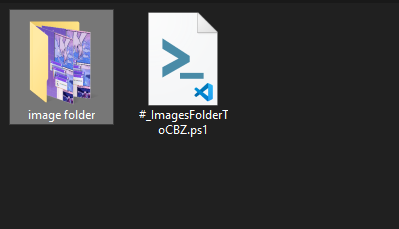
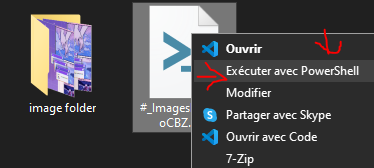
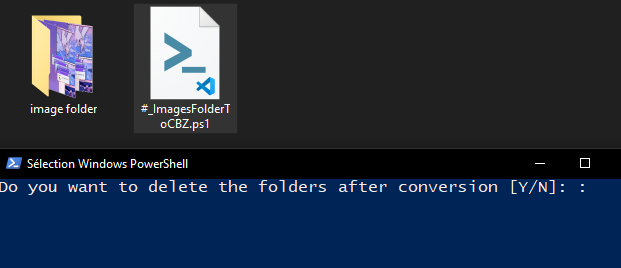
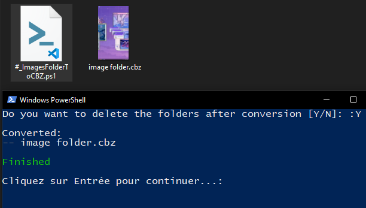

# CBZ-Manga-Creator
Converts procedurally images containers into CBZ files.

---

## Description
The function of this script is to convert an image container into a
CBZ file (used for comics or mangas, readable on Ebooks and any
devices with the good application).

## Prerequises
You need to authorize the PowerShell scripts on your computer. Go to
this URL if you don't know how: https://superuser.com/a/106363.

You will need to install 7zip if not already installed (it is faster,
more stable than WinRAR and it is Open-Source, hence free). Go to
this URL to install it: https://www.7-zip.org/.

## How do this script works
This script ZIPs all folders in the root folder of the script and
changes their extension to .CBZ.

## Notes
If you take this script into another one or a project, credits will
be appreciated. Though it is not an obligation.

## Example
### 1

### 2

### 3

### 4

