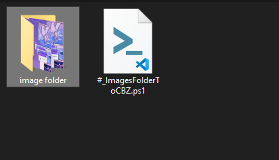
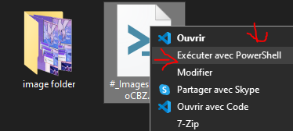
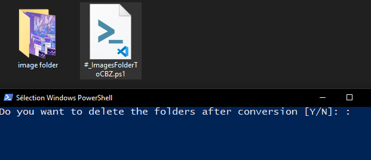
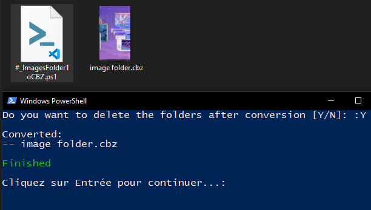

# CBZ-Manga-Creator
Converts procedurally images containers into CBZ files.

---

## Description
The function of this script is to convert an image container into a
CBZ file (used for comics or mangas, readable on Ebooks and any
devices with the good application).

## Windows Version

### Prerequises
You need to authorize the PowerShell scripts on your computer. Go to
this URL if you don't know how: https://superuser.com/a/106363.

You will need to install 7zip if not already installed. Go to
this URL to install it: https://www.7-zip.org/.

#### Why 7Zip
WinRAR have compatibility problems with my Kobo: My Kobo says I need a password file to open the file. This problem does not occur with 7Zip.

Futhermore it is faster, more stable than WinRAR and Open-Source, hence free.

### How do this script works
This script ZIPs all folders in the root folder of the script and
changes their extension to .CBZ.

### Notes
If you take this script into another one or a project, credits will
be appreciated. Though it is not an obligation.

### Example
**1)**


**2)**


**3)**


**4)**


## Linux Version

### Prerequises

You need the package `zip`, it can be installed on your package manager:
```bash
# Debian-based (Like Ubuntu)
sudo apt install zip

# Arch-based (Like CachyOS)
sudo pacman -S --needed zip

# Fedora-based (Like Nobara)
sudo dnf install zip
```

### Install the script

```bash
# Download the script
curl -o './cbz.sh' https://raw.githubusercontent.com/PonyLucky/CBZ-Manga-Creator/refs/heads/main/cbz.sh
echo "Script downloaded in ./cbz.sh"

# Ask the user to review the script
echo
read -p "Please review the script before proceeding... (Press enter to continue)"

# Make executable and move to ~/.local/bin/
chmod +x ./cbz.sh
mkdir -p ~/.local/bin
mv ./cbz.sh ~/.local/bin/cbz
echo "Done."

echo
echo "If it doesn't work, then '~/.local/bin' is not in your PATH, append this line in '~/.bashrc' or '~/.zshrc':"
echo 'export PATH="$PATH:$HOME/.local/bin"'
```

### Run

If installed and directory is in PATH, then just run:
```bash
cbz
```

It will convert all sub directories with only images in them in the current directory to CBZ.
